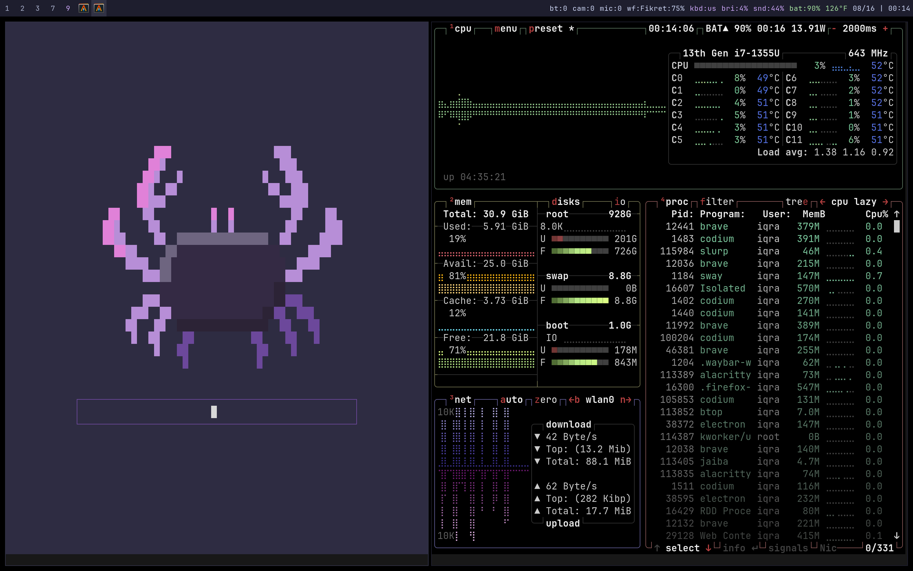
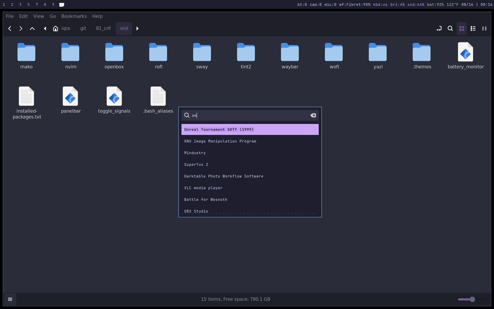

# NixOS Configurations

Just a bunch of things that I think make sense to share about how I keep my configuration organized. Most of these things probably would look better in separate files, but for now I'm enjoying having only one file where I can edit everything.

## Overview

### Package Organization

I used to have one long list of packages. Now I can create smaller groups and remember why I installed things in the first place. This also helps me avoid having a million comments explaining why every package is there.

For example, if I install several packages for something like **PCManFM** and later remove it, I know exactly which group I can remove entirely.

```nix
packages = {
    development = with pkgs; [
      ...
    ];

    developmentRust = with pkgs; [
      ...
    ];

    developmentAndroid = with pkgs; [
      ...
    ];

    developmentAndroidSamsung = with pkgs; [
      ...
    ];
};
```

### Loops

Being able to create repetitive structures in the configuration is such a time saver. I used to manually define a few keybindings for switching between workspaces, but now I only need this:

```nix
workspaces = builtins.genList (n: toString (n + 1)) 9;

workspaceBindings = builtins.concatStringsSep "\n" (
  map (n: ''
    bindsym $mod+${n} workspace number ${n}
    bindsym $mod+Shift+${n} move container to workspace number ${n}
  '') workspaces
);
```

This generates something like the following, which I can easily integrate into Sway:

```text
bindsym $mod+1 workspace number 1
bindsym $mod+Shift+1 move container to workspace number 1
...
bindsym $mod+9 workspace number 9
bindsym $mod+Shift+9 move container to workspace number 9
```

This makes it much easier to change the number of workspaces later without having to manually update every keybinding.

### CSS Parser

I had a situation where there was a lot of CSS scattered throughout the configuration, so having a way to generate CSS from Nix attributes and keep everything consistent sounded like a good idea.

Another nice thing is that the CSS I'm generating is minified. I don't actually need to read the generated CSS anymore; I only need to work with the configuration itself, which also saves some space.

```nix
environment.etc."wofi/catppuccin-mocha.css".text = css {
    "#window" = {
        "background-color" = theme.current.bg;
        "border" = "0 none";
        "border-radius" = "0";
    };

    "#outer-box" = {
        "padding" = "8px";
        "background-color" = theme.current.bg;
        "border" = "1px solid ${theme.current.blue}";
        "font-size" = "${theme.font.size}px";
        "font-family" = "\"${theme.font.family}\"";
    };
};
```

### Themes

Because there are a lot of styles shared between different modules, like Waybar and Wofi, having a global theme saves me some time. I don't have to define the same colors in multiple places, which also keeps the configuration shorter.

```nix
themes = {
    catppuccinMocha = {
        bg = "#1e1e2e";
        bgDark = "#11111b";
        bgAlt = "#313244";
        fg = "#cdd6f4";
        muted = "#a6adc8";
        blue = "#89b4fa";
        mauve = "#cba6f7";
        red = "#f38ba8";
        green = "#a6e3a1";
        peach = "#fab387";
    };
};
```

### Aliases

I used to have a `.bash_aliases` file that I would wire into every OS I installed, but now everything is managed directly in this configuration.

After building the system, you'll probably want a few useful aliases. For example, I have this one for rebuilding NixOS:

```nix
update = "clear && sudo nixos-rebuild switch";
```

This lets me simply run `update` from the terminal instead of typing the full rebuild command every time.


### Desktop Entries

The idea here is that I want to be able to open TUIs with a single click. I'm wrapping everything with **Alacritty** (my default terminal), which lets me launch these applications from **Wofi** or by clicking icons in **Waybar**.

```nix
desktop = {
    impala = pkgs.makeDesktopItem {
        name = "impala";
        desktopName = "Impala";
        comment = "Wi-Fi TUI";
        exec = "alacritty -e impala";
        terminal = false;
        categories = [ "Network" ];
    };
};
```

## Previews





## Install

### Backup Default Configuration

Copy the original NixOS configuration before replacing it:

```sh
sudo cp -a /etc/nixos ~/git/81_cnf__nixos/backup/nixos
```

### Apply Custom Configuration System-Wide

Replace the default `/etc/nixos` directory with a symlink to the Git-managed configuration:

```sh
sudo rm -rf /etc/nixos
sudo ln -s ~/git/81_cnf__nixos/nixos /etc/nixos
```

### Verify the Link

```sh
ls -ld /etc/nixos
```

It should show:

```text
/etc/nixos -> /home/iqra/git/81_cnf__nixos/nixos
```

### Rebuild

```sh
sudo nixos-rebuild switch
```
